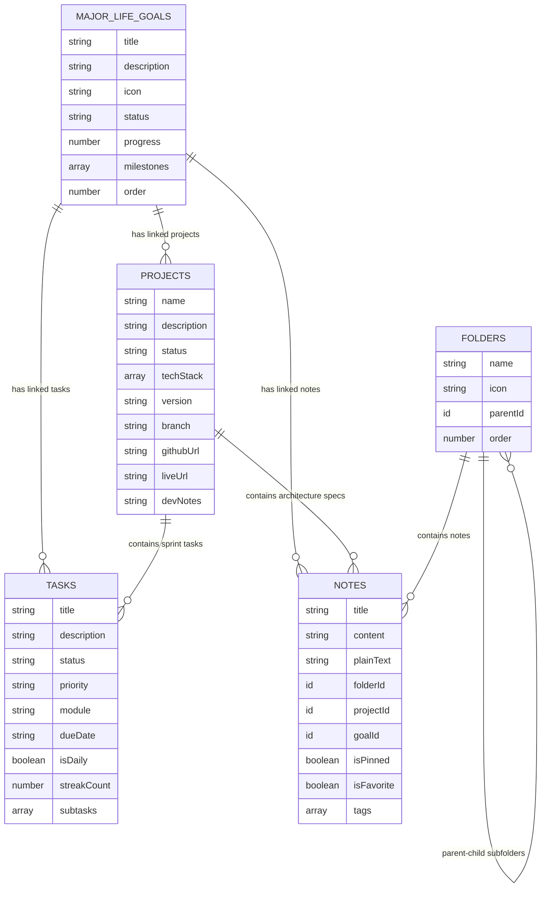
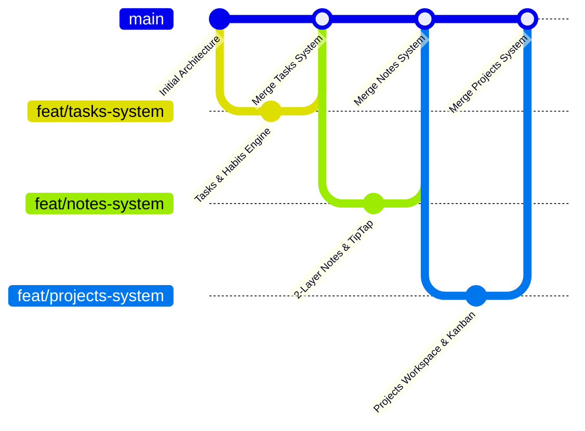

# 🏛️ MOSHA — Personal Operating System
### Comprehensive Project Documentation, Architecture Recap & Future Roadmap

---

## 📑 Table of Contents
1. [Executive Vision & Philosophy](#1-executive-vision--philosophy)
2. [Core Technology Stack & Libraries](#2-core-technology-stack--libraries)
3. [Database Schema & Convex Cloud Architecture](#3-database-schema--convex-cloud-architecture)
4. [Detailed Breakdown of Built Modules & Screens](#4-detailed-breakdown-of-built-modules--screens)
   - [Global Shell & Navigation Architecture](#global-shell--navigation-architecture)
   - [Module 1: Tasks & Daily Habits System (Home Sanctuary)](#module-1-tasks--daily-habits-system-home-sanctuary)
   - [Module 2: Major Life Goals & Milestone Bento](#module-2-major-life-goals--milestone-bento)
   - [Module 3: Notes & Knowledge Base (2-Layer Distraction-Free Workspace)](#module-3-notes--knowledge-base-2-layer-distraction-free-workspace)
   - [Module 4: Projects Workspace & Engineering Repositories Hub](#module-4-projects-workspace--engineering-repositories-hub)
5. [Git Workflow & Branching Strategy](#5-git-workflow--branching-strategy)
6. [Future Roadmap & Next Modules to Build](#6-future-roadmap--next-modules-to-build)

---

## 1. Executive Vision & Philosophy

**MOSHA** is a high-density, precision-engineered **Personal Operating System** designed for senior software engineers, founders, and ambitious individuals. It is built to unify life strategy, daily tactical execution, algorithmic mastery, technical knowledge management, software projects, physical training, and financial sovereignty into a single, cohesive, zero-latency desktop interface.

### Core Design Principles:
- **Zero-Latency Reactive Sync**: Real-time database updates via Convex Cloud with instant client-side optimistic hydration (`0ms` perceived delay).
- **Distraction-Free Tranquility**: Clean, tactile visual design inspired by the Stitch Design System, balancing high-density developer ergonomics with tranquil typography (Geist Sans, Geist Mono, and EB Garamond).
- **Deep Interconnectivity**: Every module is a standalone power-tool, yet deeply linked (e.g., Tasks link to Goals and Projects; Notes link to Projects and Life Goals; Milestones dynamically drive Goal completion).

---

## 2. Core Technology Stack & Libraries

### ⚡ Frontend & Core Framework
- **Next.js 15.2+ (App Router)**: Hybrid server/client architecture, Turbopack, route optimization, dynamic client hydration (`next/dynamic`).
- **React 19.0.0**: React Server Components, concurrent rendering, modern hooks.
- **TypeScript 5.7.3**: Strict end-to-end type safety across frontend, database schema, queries, and mutations.
- **Node.js 22+**: Modern ECMAScript environment.

### 🎨 Styling, UI & Design System
- **Tailwind CSS v4.0.7**: Atomic CSS utility engine with custom configuration.
- **Design Tokens & Color Palette**:
  - `Primary / Deep Sage`: `#333E50` (Primary brand action, header text, active states)
  - `Surface Bright / Background`: `#F9F9F9` / `#FDFDFD` (Paper-white calm backdrop)
  - `Cool Border`: `#E2E8F0` / `#ECEAE4` (Subtle boundary borders)
  - `Text Main`: `#1A202C` (Deep charcoal contrast)
  - `Slate Gray`: `#4A5568` (Secondary metadata & labels)
  - `Accent Signals`: `#10B981` (Active Emerald), `#F59E0B` (Warning Amber), `#EF4444` (Urgent Rose), `#3B82F6` (Info Blue), `#8B5CF6` (Shipped Purple).
- **Typography Engine**:
  - `Geist Sans`: High-legibility UI labels, buttons, and navigation.
  - `Geist Mono`: Code snippets, timestamps, metrics, versions, and tags.
  - `EB Garamond`: Editorial, humanistic serif titles for goals, notes, and projects.

### 🗄️ Backend & Real-Time Cloud Engine
- **Convex Cloud 1.19.2**: Serverless, type-safe reactive backend.
  - Automatic WebSocket subscriptions for live UI synchronization.
  - Document database with compound indexes (`by_order`, `by_status`, `by_due_date`, `by_project`, `by_folder`, `by_parent`, `by_pinned`).
  - Optimistic client updates with background reconciliation.

### 📝 Rich Text & Block Editing Engine
- **TipTap v3 Suite (`@tiptap/react`, `@tiptap/starter-kit`)**:
  - `@tiptap/extension-highlight`: Multi-color text highlights (Yellow, Green, Blue, Rose, Purple).
  - `@tiptap/extension-task-list` & `@tiptap/extension-task-item`: Interactive markdown task checklists.
  - `@tiptap/extension-underline`: Underline formatting.
  - `@tiptap/extension-placeholder`: Dynamic contextual placeholder text.
  - Optimized in-memory ProseMirror transactions with debounced background serialization (`0ms` typing latency).

### 🧩 UI Primitives, State & Interactions
- **Radix UI Primitives**: Accessible headless UI components:
  - `@radix-ui/react-dialog`: Modals for Task, Goal, Folder, and Project CRUD.
  - `@radix-ui/react-dropdown-menu`: Contextual action menus.
  - `@radix-ui/react-popover`: Quick action popups.
  - `@radix-ui/react-progress`: Animated milestone & sprint progress bars.
  - `@radix-ui/react-tooltip`: Tooltips for navigation icons.
  - `@radix-ui/react-tabs`: Tabbed views for Project Detail & Kanban.
- **CMDK (`cmdk` v1.0.4)**: Global Command Palette (`⌘K` / `Ctrl+K`) for instant keyboard-driven search and navigation.
- **Zustand (`zustand` v5.0.3)**: Lightweight global state management (module routing, mini/expanded sidebar state, focus stopwatch timer, modal toggles).
- **Lucide React (`lucide-react` v0.475.0)**: Modern vector icon system.
- **Canvas Confetti (`canvas-confetti` v1.9.4)**: Particle animations triggered upon milestone or sprint task completions.
- **Recharts (`recharts` v2.15.1)**: Data visualization charts for analytics and progress.

---

## 3. Database Schema & Convex Cloud Architecture

The database is defined in `convex/schema.ts` and deployed to Convex Cloud. It contains 10 core tables:

### Table Index Summary:
1. `major_life_goals`: Indexed by `by_order` and `by_status`.
2. `projects`: Indexed by `by_order` and `by_status`.
3. `tasks`: Indexed by `by_status`, `by_due_date`, `by_priority`, `by_module`, `by_daily`, `by_project`.
4. `folders`: Indexed by `by_order`, `by_parent`.
5. `notes`: Indexed by `by_folder`, `by_project`, `by_pinned`, `by_updated`.
6. `problems`: Indexed by `by_next_review`, `by_pattern`.
7. `learning_topics`: Indexed by `by_subject`.
8. `gym_sessions`: Indexed by `by_date`.
9. `finance_records`: Indexed by `by_date`.
10. `journal_entries`: Indexed by `by_date`.

---

## 4. Detailed Breakdown of Built Modules & Screens

### Global Shell & Navigation Architecture
- **Location**: `src/components/shell/`
- **SideNav (`side-nav.tsx`)**:
  - Collapsible sidebar with **Mini mode (`w-16`)** and **Expanded mode (`w-64`)**.
  - Direct navigation across all 14 personal OS modules with active indicator borders.
- **TopHeader (`top-header.tsx`)**:
  - Global real-time **Focus Stopwatch / Pomodoro Engine** (Start, Pause, Reset, Tick).
  - Module title breadcrumbs.
  - Global Action Bar: Quick `+ Task`, Quick `+ Goal`, and `⌘K` search shortcut trigger.
- **CommandMenu (`command-menu.tsx`)**:
  - Universal `⌘K` modal powered by `cmdk`.
  - Instant module navigation, quick task search, note search, and quick actions.

---

### Module 1: Tasks & Daily Habits System (Home Sanctuary)
- **Location**: `src/components/tasks/`
- **Key Features**:
  - **Dual View Modes**:
    1. **Sprint Kanban Board (`tasks-kanban-board.tsx`)**: 4 sprint columns (`To Do`, `In Progress`, `In Review`, `Done`) with 1-click status movement and confetti on completion.
    2. **High-Density Focus List (`task-item-row.tsx`)**: Linear row view with subtask checklist expander, inline status toggles, and priority indicators.
  - **Daily Habits & Streak Tracking Engine**:
    - `isDaily` habit toggle.
    - Automatic streak counting (`streakCount`) with date reconciliation (`lastCompletedDate`) preventing duplicate daily increments.
  - **Subtasks System**: Nested subtasks with real-time percentage progress bar.
  - **Filters & Module Categorization**: Filter by Module (`General`, `Problems`, `Learning`, `Gym`, `Projects`, `Finance`, `Personal`) and Priority (`Urgent`, `Medium`, `Low`).
  - **Task Creation Modal (`task-create-dialog.tsx`)**: Due date, time, module, subtask builder, life goal link, and project link.

---

### Module 2: Major Life Goals & Milestone Bento
- **Location**: `src/components/goals/`
- **Key Features**:
  - **Bento Grid Layout (`major-goals-bento.tsx`)**:
    - High-density visual cards with category icons, title, description, and status tags (`Active`, `Planning`, `Vision`, `Completed`).
    - Dynamic Progress Bar automatically calculated from milestone completions.
  - **Interactive Milestones Checklist**:
    - Check off milestones in real-time.
    - Triggers confetti celebration and updates overall life goal progress %.
  - **Life Goal CRUD Modal (`goal-dialog.tsx`)**:
    - Create/edit goals, target completion dates, and dynamic milestone item builder.

---

### Module 3: Notes & Knowledge Base (2-Layer Distraction-Free Workspace)
- **Location**: `src/components/notes/`
- **Key Features**:
  - **Clean 2-Layer Layout**:
    - **Layer 1: Knowledge Base Sidebar (`w-72` to `w-80`)**:
      - Expandable Folder Tree (`folders`) with notes nested directly inside their respective folders.
      - General / Uncategorized Notes section.
      - Real-time search bar filtering across titles, text snippets, and tags.
      - Header actions: `+ Note`, `+ Folder`, and `PanelLeftClose` (1-click collapse to give the editor **100% full screen**).
      - Folder context menu: **Rename Folder** and **Delete Folder** (safely deletes from Convex Cloud).
    - **Layer 2: Full-Width Writing Canvas (100% Remaining Screen)**:
      - Header Bar: Folder breadcrumb, tag manager (`#tag`), folder selector, linked life goal selector, Pin 📌, Favorite ⭐, Delete 🗑️.
      - Title Input with **0ms instant typing** (`localTitle` state avoiding React query re-render lags).
      - **TipTap Rich-Text Editor (`tiptap-editor.tsx`)**:
        - Headings (**H1, H2, H3**)
        - **Bold** (⌘B), *Italic* (⌘I), <u>Underline</u> (⌘U), ~~Strikethrough~~, `Inline Code`
        - 🎨 Multi-color text highlights (Yellow, Green, Blue, Rose, Purple)
        - Bullet lists (`•`), Numbered lists (`1. 2.`), and **Interactive Task Checklists** (`[ ]`)
        - Dark Monospace Code Blocks (`#1E293B`)
        - Blockquotes & Divider lines
        - Callouts (💡 *Tip*, 📌 *Note*, ⚠️ *Warning*) & Arrow symbols (`→`, `⇒`, `✓`)
        - Real-time background auto-save to Convex Cloud.

---

### Module 4: Projects Workspace & Engineering Repositories Hub
- **Location**: `src/components/projects/`
- **Key Features**:
  - **Active Repositories Gallery (Overview Grid)**:
    - Stitch Design repository cards (`Nexus API Gateway`, `Web UI Kit Core`, `Log Ingestion Pipeline`, etc.).
    - Status Pulses: `Active` (Emerald), `In Progress` (Amber), `In Review` (Blue), `Completed` (Purple), `Planning` (Slate).
    - **Dynamic Sprint Progress Bar**: Automatically calculated from linked project tasks.
    - **Tech Stack Badges**: `Rust`, `gRPC`, `Redis`, `React`, `Tailwind`, `TypeScript`, `Go`, `Kafka`, etc.
    - Release version (`v1.4.2`), working branch, and GitHub repository links.
    - Status filter dropdown and search bar.
  - **Project Detail Workspace (`project-detail-view.tsx`)**:
    - 📋 **Sprint Kanban Board (`project-kanban.tsx`)**: 4 sprint columns (`Backlog / To Do`, `In Progress`, `In Review`, `Done`) with inline task addition and 1-click status progression (`Next →`).
    - 📝 **Architecture RFCs & Dev Notes**: Embedded TipTap rich-text writing canvas for technical specs and runbooks.
    - 📊 **Progress & Metrics Tracker**: Completion rate %, task breakdown (total, done, pending), and repository metadata.
  - **Project Creation & Edit Modal (`project-dialog.tsx`)**:
    - Repository name, description, status, tech stack chip manager, release version, branch, GitHub URL, live deployment URL, and linked life goal.

---

## 5. Git Workflow & Branching Strategy

The repository follows clean trunk-based feature development:

### Clean History Summary:
- `main`: Production-ready, fully compiling codebase (`pnpm run build` with 0 errors).
- All changes were developed on dedicated feature branches (`feat/tasks-system`, `feat/notes-system`, `feat/projects-system`) and merged cleanly to `main`.

---

## 6. Future Roadmap & Next Modules to Build

The following modules are architected in `convex/schema.ts` and ready for implementation in upcoming sprints:

| Module | Purpose & Features to Deliver | Key Components |
| :--- | :--- | :--- |
| 🧩 **1. Problem Solving Hub** | Algorithmic mastery dashboard (LeetCode / Codeforces), pattern breakdown (Two Pointers, Sliding Window, Dynamic Programming, Graphs), mastery rating (1-5), spaced repetition review scheduler (`nextReviewDate`), and code snippet archive. | `ProblemsScreen`, `PatternRadar`, `ProblemReviewDeck`, `CodePlayground` |
| 📚 **2. Learning & CS Roadmaps** | Deep computer science curricula (Distributed Systems, Operating Systems, Database Engine Internals, Compilers), progress milestones, and curated technical resources. | `LearningScreen`, `RoadmapTree`, `ResourceVault` |
| 💼 **3. Engineering Career & Market** | Career radar, target tier-1 tech companies, compensation benchmarks, interview stage pipeline, and resume iteration history. | `CareerScreen`, `InterviewPipeline`, `CompanyTargetGrid` |
| 🏋️ **4. Gym & Fitness (Iron Journal)** | Workout split logger (Push/Pull/Legs, Upper/Lower), exercise sets/reps/weight tracker, total volume load calculator, 1RM calculator, and PR celebration tracker. | `GymScreen`, `WorkoutLogger`, `VolumeProgressChart` |
| 💰 **5. Sovereign Finance (Ledger)** | Financial runway calculator, monthly burn rate tracker, cash flow breakdown, multi-currency ledger, and asset allocation tracker. | `FinanceScreen`, `RunwayCalculator`, `CashFlowBento` |
| 📖 **6. Engineering Journal** | Weekly retrospectives, architectural decision records (ADRs), post-mortems, and technical lessons learned. | `JournalScreen`, `WeeklyRetroEditor`, `TagFilter` |
| 🌐 **7. Skill Graph & Mastery Radar** | Interactive visual node graph showing technical skill dependencies and proficiency scores. | `SkillGraphView`, `D3DependencyGraph` |
| 🎙️ **8. Interview Simulator Mode** | Real-time mock interview environment with system design timer, STAR framework prompts, and live whiteboard scratchpad. | `InterviewScreen`, `SystemDesignTimer` |
| 📊 **9. Analytics & Pulse** | Macro productivity metrics, focus stopwatch heatmap, habit consistency index, and weekly velocity reports. | `AnalyticsDashboard`, `VelocityHeatmap` |

---

*MOSHA System Documentation — Maintained with precision on `main`.*
